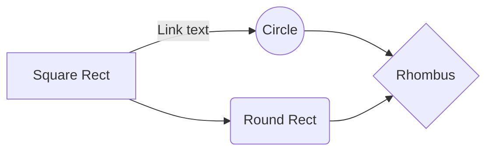
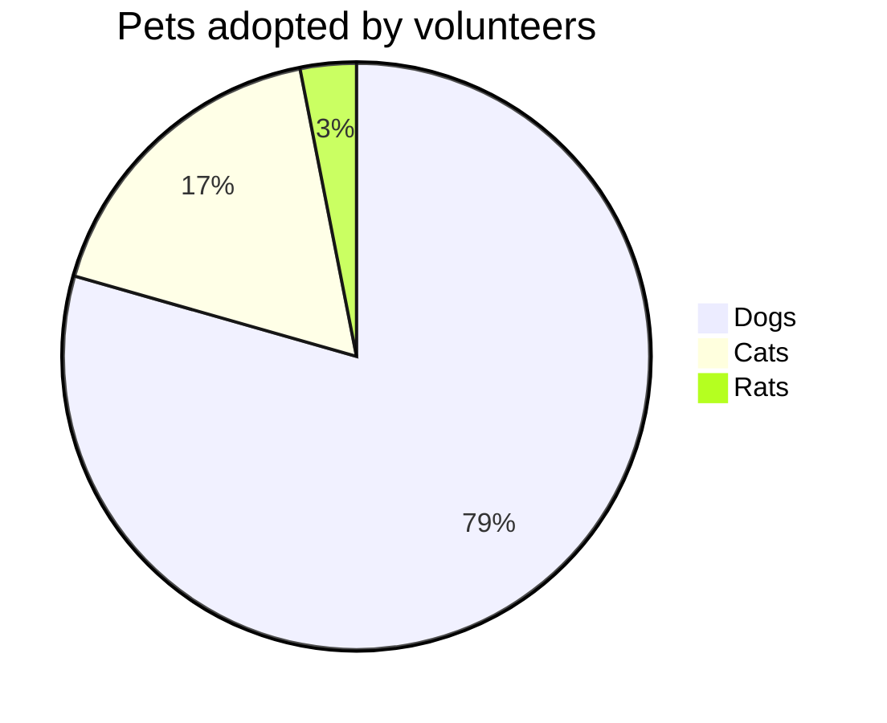
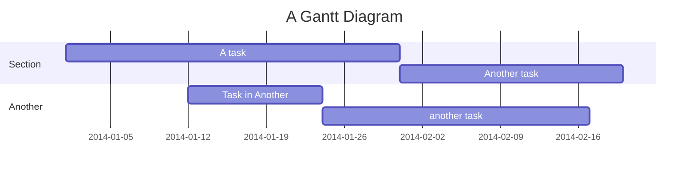
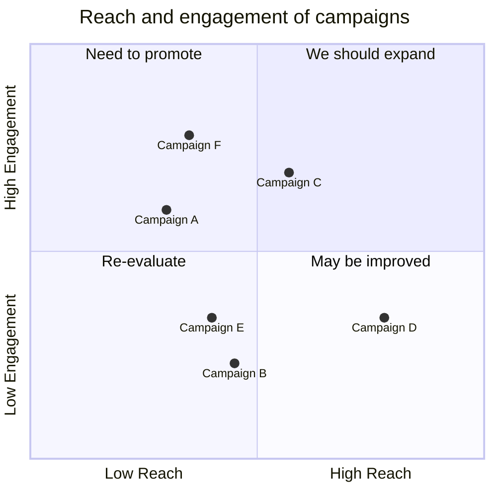
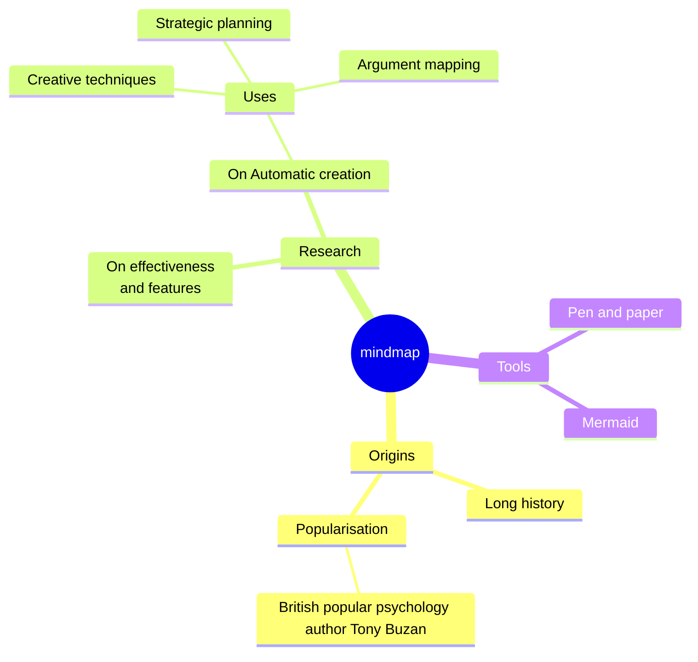
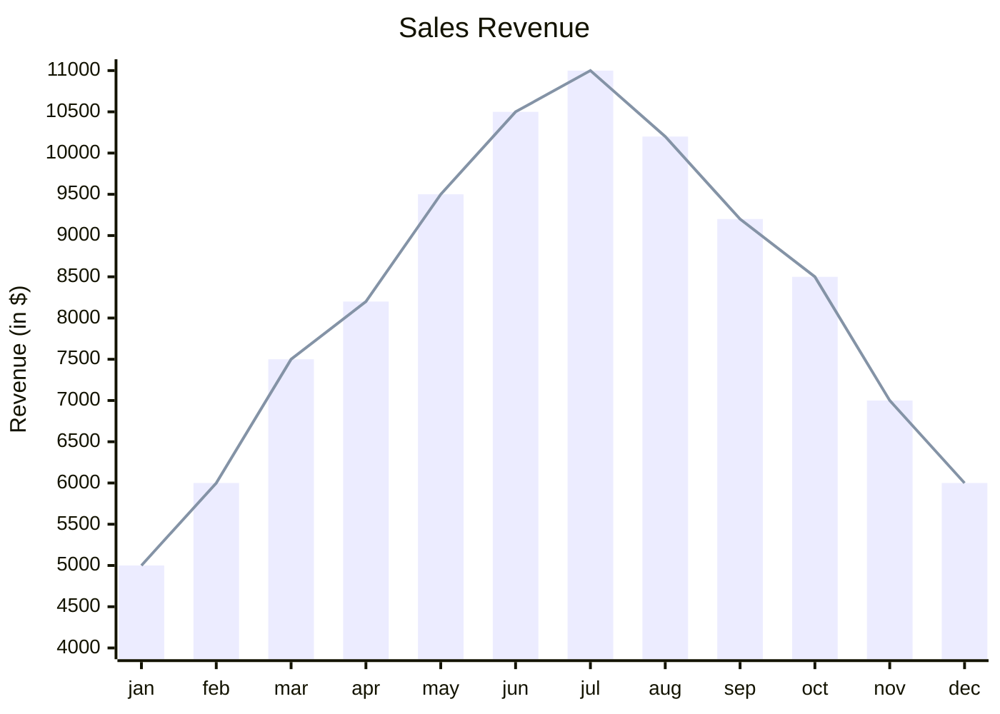
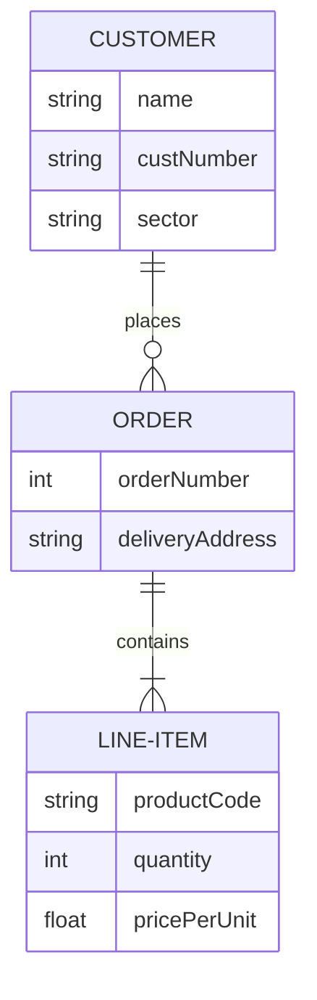
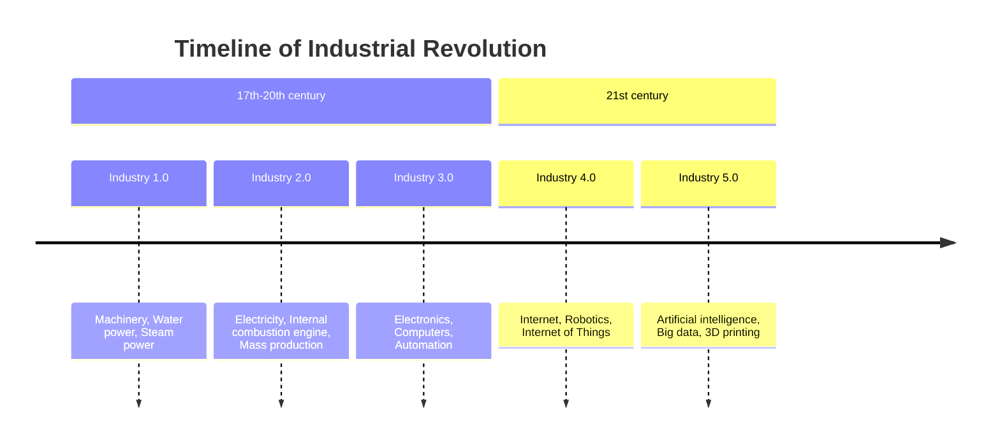
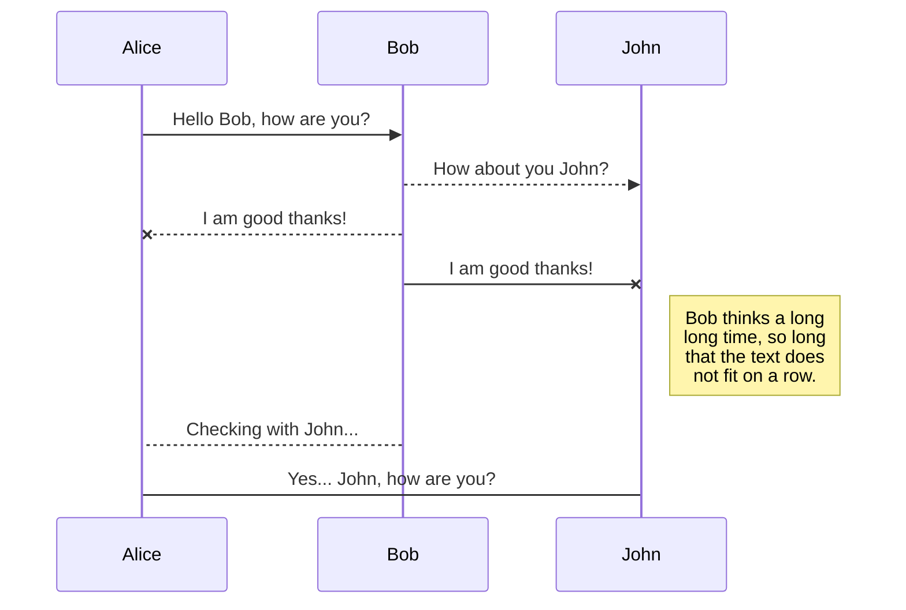

# Example Syntax

```markdown
# A first-level heading

## A second-level heading

### A third-level heading
```

## Text Styling

**Bold**

_Italic_

~~Strikethrough~~

**Bold and _nested italic_**

***All bold and italic***

This ia an example <sub>Subscript</sub>

This is an example <sup>Superscript</sup>

## Text Quoting

Text that is not a quote

> Text that is a quote
>
> The overriding design goal for Markdown's formatting syntax is to make it as readable
> as possible. The idea is that a Markdown-formatted document should be
> publishable as-is, as plain text, without looking like it's been marked up with tags
> or formatting instructions.

## Alerts

> [!NOTE]
> Useful information that users should know, even when skimming content.

> [!TIP]
> Helpful advice for doing things better or more easily.

> [!IMPORTANT]
> Key information users need to know to achieve their goal.

> [!WARNING]
> Urgent info that needs immediate user attention to avoid problems.

> [!CAUTION]
> Advises about risks or negative outcomes of certain actions.

## Quoting Code

This is `inline` code quote, versus a code block:

```json
{
  "this is a code block": true,
  "multiple lines": true
}
```

See this [link](https://github.com/github-linguist/linguist/blob/master/lib/linguist/languages.yml) for valid code block keywords.

## Links

This site was built using [GitHub Pages](https://pages.github.com/).

## Section Links

This points to the previous header [Links](#links)

## Relative Links

[Contribution guidelines for this project](docs/CONTRIBUTING.md)

## Images


## Lists

- George Washington
- John Adams
- Thomas Jefferson

## Nested Lists

1. First list item
   - First nested list item
     - Second nested list item

## Task List

- [x] #739
- [ ] https://github.com/octo-org/octo-repo/issues/740
- [ ] Add delight to the experience when all tasks are complete :tada:

## Footnotes

Here is a simple footnote[^1].

A footnote can also have multiple lines[^2].

[^1]: My reference.
[^2]: To add line breaks within a footnote, prefix new lines with 2 spaces.
  This is a second line.

## Hiding Contents with Comments

<!-- This content will not appear in the rendered Markdown -->

## Tables

| Title1   | Title2  | Title3  |
|----------|---------|---------|
| Cell 1.1 | Row 1.2 | Row 1.3 |
| Cell 2.1 | Row 2.2 | Row 2.3 |

## Flowchart



## Pie Chart



## Gantt Chart



## Quadrant Chart



## Mindmap



## XY Chart



## Entity Relationship Diagram



## Timeline




## UML Diagrams

You can render UML diagrams using [Mermaid](https://mermaidjs.github.io/). For example, this will produce a sequence diagram:


